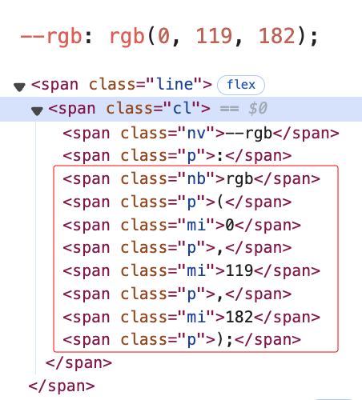

+++ 
draft = false
date = 2025-02-10
title = "Stylize Chroma Const Colors"
description = "Script to style css color values in Chroma-generated code blocks"
slug = ""
authors = []
tags = ["Hugo", "CSS", "Chroma"]
categories = []
externalLink = ""
series = []
+++

# The problem
[Colorize](https://marketplace.visualstudio.com/items?itemName=kamikillerto.vscode-colorize) is one of my must-have VS Code extensions. Unfortunately, this extension doesn't help with code snippets here, on my website. Hugo uses [Chroma](https://github.com/alecthomas/chroma) to convert markdown code blocks into html at build time and there are a ton of [styles to choose from](https://xyproto.github.io/splash/docs/). Chroma's styling system is customizable too, but it isn't flexible enough to support this use-case with custom CSS alone. Chroma's output can be configured to directly apply styles inline or you can generate (or write your own) stylesheet and the generated html will reference well-known classnames. Unfortunately, what I'd need is for the HTML to include a new attribute

I could probably achieve this by writing a custom lexer for Chroma. Instead of encoding `#ff0000` as `<span class="mh">#ff0000</span>`, it could write the CSS color value to a data-color attribute like `<span data-color="#ff0000" class="mh">#ff0000</span>`. This, plus one of my favorite new CSS features, `attr` allows me to style the background and foreground colors based on the data-color attribute's value:

```css
.mh[data-color] {
    background-color: white; /* fallback when attr isn't supported */
    background-color: attr(data-color, type(<color>), white);

    color: black; /* fallback when attr isn't supported */
    color: contrast-color(attr(data-color, type(<color>), black));
}
```

I'm also using `contrast-color` in that snippet, which doesn't exist today. From my sleuthing, it sounds like Safari implemented it as an experimental feature, it was at one point documented on MDN, other browsers didn't follow suite, and the MDN link was broken. It appears in in the CSS Working Group's [DRAFT: CSS Color Module Level 6](https://drafts.csswg.org/css-color-6/#colorcontrast) now. Until then, perhaps I could whip something up with a mix-blend-mode. Or worst-case, my custom lexer could add a data-color-contrast property at build time.

But, I don't want to write a lexer and fork myself from the safe defaults. I bet I could make a "good enough" solution with a little JavaScript...

## The solution
The solution I landed on is a little JavaScript that looks for well-formed color values and when it finds one, calculates the best contrasting foreground color and applies an inline style to the DOM element.

## Show me the code!


```typescript
type RGB = [number, number, number];

function getNamedColorHex(colorName): RGB | null {
    const colorMap: { [key: string]: RGB } = {
        "aliceblue": [240, 248, 255],
        "antiquewhite": [250, 235, 215],
        "aqua": [0, 255, 255],
        "aquamarine": [127, 255, 212],
        "azure": [240, 255, 255],
        "beige": [245, 245, 220],
        "bisque": [255, 228, 196],
        "black": [0, 0, 0],
        "blanchedalmond": [255, 235, 205],
        "blue": [0, 0, 255],
        "blueviolet": [138, 43, 226],
        "brown": [165, 42, 42],
        "burlywood": [222, 184, 135],
        "cadetblue": [95, 158, 160],
        "chartreuse": [127, 255, 0],
        "chocolate": [210, 105, 30],
        "coral": [255, 127, 80],
        "cornflowerblue": [100, 149, 237],
        "cornsilk": [255, 248, 220],
        "crimson": [220, 20, 60],
        "cyan": [0, 255, 255], // (synonym of aqua)
        "darkblue": [0, 0, 139],
        "darkcyan": [0, 139, 139],
        "darkgoldenrod": [184, 134, 11],
        "darkgray": [169, 169, 169],
        "darkgreen": [0, 100, 0],
        "darkgrey": [169, 169, 169],
        "darkkhaki": [189, 183, 107],
        "darkmagenta": [139, 0, 139],
        "darkolivegreen": [85, 107, 47],
        "darkorange": [255, 140, 0],
        "darkorchid": [153, 50, 204],
        "darkred": [139, 0, 0],
        "darksalmon": [233, 150, 122],
        "darkseagreen": [143, 188, 143],
        "darkslateblue": [72, 61, 139],
        "darkslategray": [47, 79, 79],
        "darkslategrey": [47, 79, 79],
        "darkturquoise": [0, 206, 209],
        "darkviolet": [148, 0, 211],
        "deeppink": [255, 20, 147],
        "deepskyblue": [0, 191, 255],
        "dimgray": [105, 105, 105],
        "dimgrey": [105, 105, 105],
        "dodgerblue": [30, 144, 255],
        "firebrick": [178, 34, 34],
        "floralwhite": [255, 250, 240],
        "forestgreen": [34, 139, 34],
        "fuchsia": [255, 0, 255],
        "gainsboro": [220, 220, 220],
        "ghostwhite": [248, 248, 255],
        "gold": [255, 215, 0],
        "goldenrod": [218, 165, 32],
        "gray": [128, 128, 128],
        "green": [0, 128, 0],
        "greenyellow": [173, 255, 47],
        "grey": [128, 128, 128], // (synonym of gray),
        "honeydew": [240, 255, 240],
        "hotpink": [255, 105, 180],
        "indianred": [205, 92, 92],
        "indigo": [75, 0, 130],
        "ivory": [255, 255, 240],
        "khaki": [240, 230, 140],
        "lavender": [230, 230, 250],
        "lavenderblush": [255, 240, 245],
        "lawngreen": [124, 252, 0],
        "lemonchiffon": [255, 250, 205],
        "lightblue": [173, 216, 230],
        "lightcoral": [240, 128, 128],
        "lightcyan": [224, 255, 255],
        "lightgoldenrodyellow": [250, 250, 210],
        "lightgray": [211, 211, 211],
        "lightgreen": [144, 238, 144],
        "lightgrey": [211, 211, 211],
        "lightpink": [255, 182, 193],
        "lightsalmon": [255, 160, 122],
        "lightseagreen": [32, 178, 170],
        "lightskyblue": [135, 206, 250],
        "lightslategray": [119, 136, 153],
        "lightslategrey": [119, 136, 153],
        "lightsteelblue": [176, 196, 222],
        "lightyellow": [255, 255, 224],
        "lime": [0, 255, 0],
        "limegreen": [50, 205, 50],
        "linen": [250, 240, 230],
        "magenta": [255, 0, 255], // (synonym of fuchsia),
        "maroon": [128, 0, 0],
        "mediumaquamarine": [102, 205, 170],
        "mediumblue": [0, 0, 205],
        "mediumorchid": [186, 85, 211],
        "mediumpurple": [147, 112, 219],
        "mediumseagreen": [60, 179, 113],
        "mediumslateblue": [123, 104, 238],
        "mediumspringgreen": [0, 250, 154],
        "mediumturquoise": [72, 209, 204],
        "mediumvioletred": [199, 21, 133],
        "midnightblue": [25, 25, 112],
        "mintcream": [245, 255, 250],
        "mistyrose": [255, 228, 225],
        "moccasin": [255, 228, 181],
        "navajowhite": [255, 222, 173],
        "navy": [0, 0, 128],
        "oldlace": [253, 245, 230],
        "olive": [128, 128, 0],
        "olivedrab": [107, 142, 35],
        "orange": [255, 165, 0],
        "orangered": [255, 69, 0],
        "orchid": [218, 112, 214],
        "palegoldenrod": [238, 232, 170],
        "palegreen": [152, 251, 152],
        "paleturquoise": [175, 238, 238],
        "palevioletred": [219, 112, 147],
        "papayawhip": [255, 239, 213],
        "peachpuff": [255, 218, 185],
        "peru": [205, 133, 63],
        "pink": [255, 192, 203],
        "plum": [221, 160, 221],
        "powderblue": [176, 224, 230],
        "purple": [128, 0, 128],
        "rebeccapurple": [102, 51, 153],
        "red": [255, 0, 0],
        "rosybrown": [188, 143, 143],
        "royalblue": [65, 105, 225],
        "saddlebrown": [139, 69, 19],
        "salmon": [250, 128, 114],
        "sandybrown": [244, 164, 96],
        "seagreen": [46, 139, 87],
        "seashell": [255, 245, 238],
        "sienna": [160, 82, 45],
        "silver": [192, 192, 192],
        "skyblue": [135, 206, 235],
        "slateblue": [106, 90, 205],
        "slategray": [112, 128, 144],
        "slategrey": [112, 128, 144],
        "snow": [255, 250, 250],
        "springgreen": [0, 255, 127],
        "steelblue": [70, 130, 180],
        "tan": [210, 180, 140],
        "teal": [0, 128, 128],
        "thistle": [216, 191, 216],
        "tomato": [255, 99, 71],
        "turquoise": [64, 224, 208],
        "violet": [238, 130, 238],
        "wheat": [245, 222, 179],
        "white": [255, 255, 255],
        "whitesmoke": [245, 245, 245],
        "yellow": [255, 255, 0],
        "yellowgreen": [154, 205, 50]
    };

    return colorMap[colorName.trim().toLowerCase()] || null;
}

// Function to calculate relative luminance for contrast calculations
function getLuminance(rgb: RGB): number {
    let [rs, gs, bs] = rgb.map(v => {
        v = v / 255;
        return v <= 0.03928 ? v / 12.92 : Math.pow((v + 0.055) / 1.055, 2.4);
    });
    return 0.2126 * rs + 0.7152 * gs + 0.0722 * bs;
}

// Function to calculate contrast ratio between two colors
function getContrastRatio(l1: number, l2: number): number {
    let lighter = Math.max(l1, l2);
    let darker = Math.min(l1, l2);
    return (lighter + 0.05) / (darker + 0.05);
}

function cssColorToRGB(color): RGB {
    const namedColorHex = getNamedColorHex(color);
    if (namedColorHex !== null) {
        return namedColorHex;
    }

    if (color.startsWith('#')) {
        const hexToDecimal = hex => parseInt(hex, 16);
        if (color.length === 4 || color.length === 5) {
            // #RGB or #RGBA format
            return [
                hexToDecimal(color[1] + color[1]),
                hexToDecimal(color[2] + color[2]),
                hexToDecimal(color[3] + color[3])
            ];
        } else if (color.length === 7 || color.length === 9) {
            // #RRGGBB or #RRGGBBAA format
            return [
                hexToDecimal(color.slice(1, 3)),
                hexToDecimal(color.slice(3, 5)),
                hexToDecimal(color.slice(5, 7))
            ];
        }
    } else if (color.startsWith('rgb')) {
        const match = color.match(/^rgba?\((\d+),\s*(\d+),\s*(\d+)/);
        if (match) {
            return [
                parseInt(match[1], 10),
                parseInt(match[2], 10),
                parseInt(match[3], 10)
            ];
        }
    }

    // Future?: support hsb, hsv, hsl, lch, oklch
    throw new Error('Invalid color format or color not supported');
}

// Function to determine if white or black text has better contrast
function getBestTextColor(bgColor: RGB) {
    const bgLuminance = getLuminance(bgColor);
    const whiteLuminance = getLuminance([255, 255, 255]);
    const blackLuminance = getLuminance([0, 0, 0]);

    const whiteContrast = getContrastRatio(whiteLuminance, bgLuminance);
    const blackContrast = getContrastRatio(blackLuminance, bgLuminance);

    return whiteContrast > blackContrast ? '#fff' : '#000';
}

function stylizeChromaConstColors() {
    const code = ".highlight>pre.chroma>code";
    const spanClasses = ['mh', 'kc', 's1', 's2'];
    spanClasses.forEach(spanClass => {
        document.querySelectorAll(`${code} span.${spanClass}`).forEach(span => {
            let textContent = (span as HTMLSpanElement).textContent?.trim() || '';

            // Special case for string literals containing color values
            if ((textContent.startsWith("'") && textContent.endsWith("'")) || (textContent.startsWith('"') && textContent.endsWith('"'))) {
                textContent = textContent.slice(1, -1);
            }

            try {
                const rgb = cssColorToRGB(textContent);
                if (rgb) {
                    (span as HTMLSpanElement).style.backgroundColor = textContent;
                    (span as HTMLSpanElement).style.color = getBestTextColor(rgb);
                }
            } catch (e) {
                // With addition of span.s1 and span.s2, this "error" case is expected and noisy
                //console.log(`Failed to process color '${innerText}' for element '${span}'`, e);
            }
        });
    });
}

document.addEventListener('DOMContentLoaded', () => {
    stylizeChromaConstColors();
});
```


## Installation
* Put [stylize-chroma-const-colors.ts](stylize-chroma-const-colors.ts) in `/assets/ts`
* Added script tag to `themes/hugo-coder/layouts/_default/baseof.html`. Note that Hugo is compiling the TypeScript to js and minifying it for me ==> 4.6 kB minified js, 2.5 kB brotli compressed. 
  ```
  {{ $stylizeChromaConstColors := resources.Get "ts/stylize-chroma-const-colors.ts" | js.Build | minify }}
  <script src="{{ $stylizeChromaConstColors.RelPermalink }}" defer></script>
  ```

## Result
We'll test on a couple different file types, because Chroma uses a different lexer for each. This post is pulling double-duty as all my test cases in one place.

### css
```css
:root {
    --hex: #0077b6;
    --hexWithAlpha: #0077b680;
    --hexShort: #08b;
    --hexShortWithAlpha: #08b8;
    --rgb: rgb(0, 119, 182);
    --rgba: rgba(0, 119, 182, 0.5);

    --named1: white;
    --named2: black;
    --named3: rebeccapurple;
}
```
Yay, the foreground color is appropriately switching between white and black, depending on contrast. 

But, this points out a problem -- Chroma's css lexer treats the rgb and rgba expressions as a function call with parameters rather than a value. I may write a more sophisticated chunk of code that looks for this specific DOM structure, but it doesn't sound fun. Since the background color should only be applied to the rgb value text, not the "--rgb:" css variable declaration on the same line, these 8 span elements need to be given a new parent node.


### HTML
```html
<html>
  <body style="color: #fff; background-color: #2a2a2a">
  </body>
</html>
```
(Also a bummer ... Chroma's html lexer doesn't parse individual css properties within a literal string, which now that I think about it makes sense, but points out the limitations of my approach.)

### JavaScript
```
const hex = '#0077b6';
const hexWithAlpha = '#0077b680';
const hexShort = '#08b';
const hexShortWithAlpha = '#08b8';
const rgb = 'rgb(0, 119, 182)';
const rgba = 'rgba(0, 119, 182, 0.5)';
const rebeccapurple = 'rebeccapurple'; // single quotes
const chartreuse = "chartreuse"; // double quotes
const chocolate = `chocolate`; // template literals
```
(And one more bummer ... Chroma parses template literals differently from single and double-quotes. I could special-case it, but this doesn't get used often enough to bother. Template literals are generally reserved for use when there's other text involved, and I'm only colorizing literals containing exactly a color value, so this won't come up in practice.)

## Future improvements
I doubt I'll come back to this for quite some time, but if I did there are a few areas I'd be interested in improving. If anyone takes this up as a fun challenge and you get something working, don't hesitate to reach out.
1. My [code shortcode](http://localhost:1313/2025/02/0004-hugoshortcodes/#code-shortcode) currently leaves a lot to be desired. I'd love to add a "copy to clipboard" button, a filename or language label, param to control whether the snippet is collapsed or expanded by default, and more. This could be a good opportunity to upgrade it to a web component. Once it is a web component, I could see it being useful to roll this client-side color styling JavaScript to the web component rather than a script that "sees" the entire html document. Hypothetically, there could be some performance improvements there from being able to highlight each code snippet individually (though, I could also achieve that with a little more JS to finds the code snippets and processes them one at a time with a [Scheduler.yield()](https://developer.mozilla.org/en-US/docs/Web/API/Scheduler/yield)), only downloading and running the JS on pages that contain a code snippet in the first place, and running querySelectorAll against less DOM.
2. Add support for all the color formats (hsb, hsl, lch, oklch) as well as get rgb and rgba working. This likely requires writing a Chroma lexer or hacking together some nasty JavaScript to special-case find the tokens that Chroma's lexer outputs for function calls.
3. Add popup offering easily copy-able color values in all formats (hex, rgb, etc.)